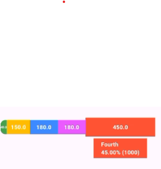
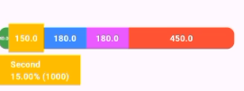

# Simple Horizontal Progress Bar

 

A Flutter package that provides a customizable bar chart for visualizing data easily and effectively.

## Features

- Display data as animated bars with tooltips.
- Support for percentage and raw value display.
- Customizable colors, fonts, and styles.
- Responsive layout for different screen sizes.

## Getting Started

## Screenshots

Here are some screenshots of the package in action:

### Example Bar Chart



### Another Example



### Installation

Add the following line to your `pubspec.yaml` file:

```yaml
dependencies:
  simple_horizontal_bar: ^1.0.0
```
